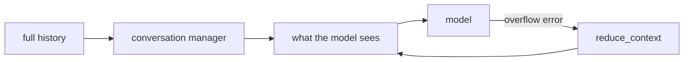
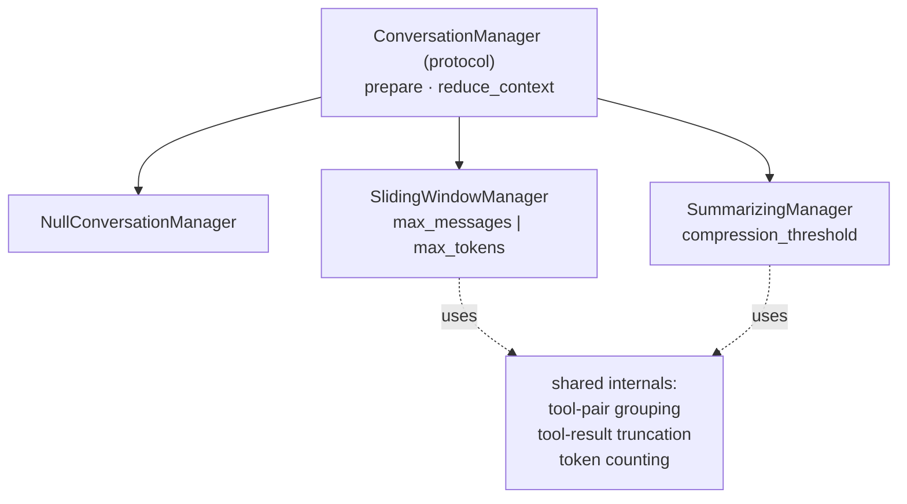

# Context Management Architecture — Design Notes

This note is a local design guide for how Sophons decides what a model sees.
It records a problem with the current shape, the proposed replacement, and
the reasoning for each divergence from other SDKs.

Status: **implemented**. See the migration section for what changed.

## Core Idea

Conversation history grows without bound; the model's context window does
not. Something must decide what to keep.



There are exactly three answers to "what do we keep":

1. everything
2. the recent part
3. the recent part, plus a summary of the rest

Everything else — how you measure size, how you avoid splitting a tool call
from its result, how you shrink an oversized tool result — is machinery in
service of those three, not a fourth answer.

## The problem with the current shape

Sophons exposes six manager classes plus a counter protocol:

```
NullConversationManager
SlidingWindowManager
TokenBudgetManager
ToolInteractionCompactor
SummarizingManager
ManagerPipeline
```

Only three of those are strategies. The rest are mechanisms that leaked into
the strategy namespace:

- **`TokenBudgetManager` is not a strategy.** It is a sliding window measured
  in tokens rather than messages. That is a parameter.
- **`ToolInteractionCompactor` is not a strategy.** It shrinks tool traffic —
  something every manager should do *before* it resorts to discarding whole
  messages.
- **`ManagerPipeline` exists only to recombine what should not have been
  split.** It is a symptom of the decomposition, not a feature.

The most serious consequence: **correctness became a strategy choice.**
`SlidingWindowManager` can return a tool result whose originating tool call
was dropped — an orphan that some providers reject outright.
`TokenBudgetManager` cannot, because it groups tool interactions into atomic
units. So picking a strategy silently picks whether the output is well-formed.
`tests/test_conversation.py::test_sliding_window_can_split_a_tool_pair`
currently documents that as behaviour. It is a bug.

For comparison, Strands exposes three managers and two methods, and folds
tool-pair preservation and tool-result truncation *into* the sliding window
rather than offering them as alternatives to it.

## Proposed shape



Three public strategies:

```python
NullConversationManager()

SlidingWindowManager(
    max_messages: int | None = None,
    max_tokens: int | None = None,
    token_counter: TokenCounter | None = None,   # defaults when max_tokens set
    truncate_tool_results: bool = True,
    preserve_system_messages: bool = True,
)

SummarizingManager(
    model: ChatModel,
    keep_recent_messages: int,
    compression_threshold: float | None = None,  # fraction of the window
    trigger_message_count: int | None = None,
    trigger_token_count: int | None = None,
    token_counter: TokenCounter | None = None,
)
```

Two protocol methods:

```python
def prepare(messages, context) -> list[Message]: ...
def reduce_context(messages, context, error) -> list[Message]: ...
```

### What moves where

| Today | Becomes |
|---|---|
| `TokenBudgetManager(max_tokens=n, ...)` | `SlidingWindowManager(max_tokens=n)` |
| `ToolInteractionCompactor(keep_recent=n)` | `truncate_tool_results=True` (default, applied before dropping) |
| `ManagerPipeline([...])` | deleted — nothing left to recombine |
| tool-pair grouping in `TokenBudgetManager` | shared internal, used by every manager, always on |
| `ApproximateTokenCounter` as a required argument | the default whenever a token limit is set |

## Decisions and their reasons

**Tool-pair preservation is an invariant, not an option.** Sending a tool
result without its call is never what anyone wants. It moves into a shared
private helper and stops being reachable as a configuration.

**Truncation runs before dropping.** Shrinking a 10 KB tool result costs
nothing in meaning; dropping the message that contains it costs the agent its
record of what it did. Ordering these correctly is the point of merging them.

**`prepare()` stays pure — a deliberate divergence.** Strands mutates the
agent's message list in `apply_management`. Sophons returns a view. Purity is
why these managers are a few lines each and testable without constructing an
agent, and it keeps the full history intact for sessions and observability.
The cost is real and is addressed below.

**`reduce_context()` is borrowed from Strands.** An agent that exceeds its
window currently raises an unhandled provider error. Catching a typed
overflow, letting the manager reduce, and retrying is the difference between
degrading and failing. This is convergent design: any SDK that can overflow
needs it.

**A ratio beats an absolute threshold.** `compression_threshold=0.7` means
"compress past 70% of this model's window", which the library derives from
`model.context_window`. An absolute token count pushes onto the caller a
number they cannot pick correctly. Also from Strands, whose
`proactive_compression` expresses the same idea for the same reason.

**Token counting is a default, never a requirement.** A protocol with no
implementation meant `TokenBudgetManager` could not be constructed from the
library alone. Any manager with a token limit and no counter uses
`ApproximateTokenCounter`.

## Known gaps this does not close

**Compression is recomputed, not persisted.** Because `prepare()` is pure and
`AgentLoop` only ever appends to `history`, a summarizing manager re-summarizes
on every model call — three steps past the threshold means three summarization
calls over near-identical history
(`test_summarizing_recomputes_on_every_call`). The summary-merging path in
`SummarizingManager` is likewise unreachable through `AgentLoop`, since no
summary is ever fed back in as history.

Fixing this means the loop caching a manager's output against the history it
covered, so a summary is computed once and reused until the history changes
beneath it. That preserves purity — the manager stays a function; the *loop*
gains a cache — and is a separate piece of work from this refactor.

**Messages without ids escape the token budget.** The current filter is
`m.id in kept_ids or m.id is None`, so any message lacking an id bypasses the
limit entirely; model adapters return assistant messages with no id
(`test_token_budget_always_keeps_messages_without_ids`). The merged window
manager should select by position rather than by id set.

## Migration — done

1. ✅ `reduce_context` added to the protocol and to all three managers.
   `SlidingWindowManager` halves its window; `SummarizingManager` summarizes
   below its own trigger; `NullConversationManager` re-raises rather than
   returning the identical request.
2. ✅ `TokenBudgetManager` merged into `SlidingWindowManager(max_tokens=...)`.
3. ✅ Tool-pair grouping moved to `_group_units`, applied by every manager.
4. ✅ `ToolInteractionCompactor` folded into `truncate_tool_results`, on by
   default, applied before anything is dropped.
5. ✅ `ManagerPipeline` deleted.
6. ✅ Both defect-pinning tests inverted:
   `test_sliding_window_can_split_a_tool_pair` became
   `test_sliding_window_never_splits_a_tool_pair`, and
   `test_token_budget_always_keeps_messages_without_ids` became
   `test_token_budget_bounds_messages_without_ids`. A third,
   `test_sliding_window_hoists_a_late_system_message`, became
   `test_sliding_window_preserves_original_ordering` — the window no longer
   reorders history.
7. ⬜ `memory/context_window.py` in sophons-examples, still to write against
   the new shape.

Verified end to end: an agent facing a model that rejects oversized requests
fails outright with no manager (`attempts=[13]`) and recovers with one
(`attempts=[10, 5]` — rejected at ten messages, halved, retried, succeeded).

### Selection by position, not by id

The merged window selects on list positions rather than a set of message ids.
The old id-set filter ended `m.id in kept_ids or m.id is None`, which let any
message without an id through regardless of budget — and model adapters return
assistant messages with no id. Positions have no such escape hatch.
