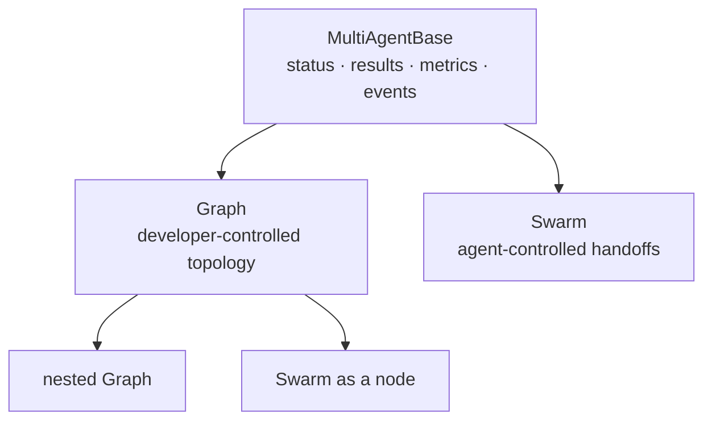
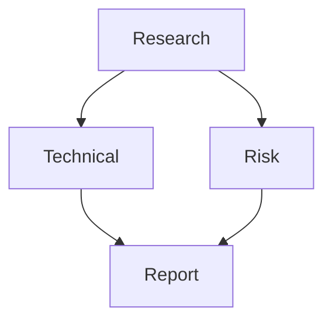
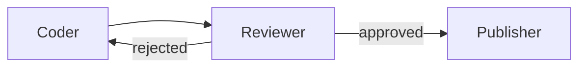
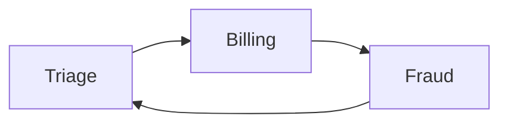

# Multi-Agent Architecture — Graph and Swarm

Status: **partially implemented**. Graph and Swarm core runtimes are available;
events, executor adapters, durable resume, and advanced policies remain planned.

## Implementation status

- Phase 1: shared status, results, metrics, interrupts, and base runtime complete.
- Phase 2: modular Graph core complete, including joins, cycles, history, limits,
  nested orchestrators, deterministic outputs, and unit tests.
- Phase 3: modular Swarm core complete, including structured handoffs, allowed
  targets, bounded context, safety limits, nesting, and unit tests.
- Phase 4 onward: events, hooks, tracing, policies, and durable execution remain
  future work.

## Purpose

Sophons currently supports composing agents manually: call them in sequence,
run them with `asyncio.gather`, expose them through `AgentTool`, or write a
review loop in application code. Those techniques are useful, but every
application must rebuild execution state, limits, metrics, failure handling,
and observability.

Multi-agent orchestration should become an SDK capability with two distinct
patterns:

- **Graph** — the developer defines the allowed topology and the runtime
  executes it deterministically.
- **Swarm** — agents share a task and decide at runtime which specialist should
  act next.

They share result, status, metrics, event, and persistence machinery, but they
must remain separate abstractions. A graph should not pretend to be autonomous;
a swarm should not pretend to be deterministic.



## Design principles

1. **Control flow is explicit.** Nodes do work; edges decide what may happen
   next; state records what has happened.
2. **Determinism and agency can coexist.** A node may be deterministic Python,
   one agent run, or a complete nested orchestrator.
3. **Correctness is the default.** Fan-in waits for all dependencies unless the
   caller explicitly selects `join="any"`.
4. **Structured output stays structured.** Node results preserve
   `AgentResult.output`; prompt formatting happens only at an agent boundary.
5. **Every loop is bounded.** Cycles, handoffs, node calls, and wall-clock time
   have explicit limits.
6. **Failures are data.** A graph or swarm returns a failed result with node
   context instead of losing partial execution history.
7. **Composition is recursive.** An Agent, Graph, Swarm, or deterministic node
   can satisfy the same executor contract.
8. **Persistence is designed in, delivered in phases.** Runtime state must be
   serializable even if durable resume lands after the first execution engine.

## Package shape

```text
src/sophons/multiagent/
├── __init__.py
├── base.py
├── interrupts.py
├── graph/
│   ├── __init__.py
│   ├── types.py
│   ├── builder.py
│   └── runtime.py
└── swarm/
    ├── __init__.py
    ├── types.py
    ├── handoff.py
    └── runtime.py
```

`events.py` and `executors.py` will be added in Phase 4 when their contracts are
stable.

The public API remains flat:

```python
from sophons.multiagent import (
    FunctionNode,
    Graph,
    GraphBuilder,
    GraphResult,
    Swarm,
    SwarmResult,
)
```

The implementation should not reproduce a large monolithic `graph.py` or
`swarm.py`. Splitting types, construction, and runtime scheduling keeps the
state machine testable without constructing model-backed agents.

## Shared foundation

### Executor contract

Graph nodes must not depend on the concrete `Agent` class. They target a small
runtime-checkable protocol:

```python
class MultiAgentExecutor(Protocol):
    async def run(
        self,
        input: str,
        *,
        invocation_state: dict[str, Any] | None = None,
        **kwargs: Any,
    ) -> AgentResult | MultiAgentResult: ...
```

An adapter wraps `Agent`, because `Agent.run()` does not accept
`invocation_state`. `Graph` and `Swarm` implement the protocol directly.
`FunctionNode` adapts sync or async Python functions.

This separation allows local agents, deterministic code, nested orchestrators,
and future remote agents without hard-coding each type into the scheduler.

### Status and results

Shared status values:

```text
PENDING
EXECUTING
COMPLETED
FAILED
INTERRUPTED
```

Timeouts and limit exhaustion are failure reasons, not additional lifecycle
states. They belong in a stable stop reason or error field.

`NodeResult` contains the latest execution payload:

```text
result: AgentResult | MultiAgentResult | Exception | None
status
execution_time
accumulated metrics
execution count
interrupts
```

Graph history wraps each result in `NodeExecution`, which adds `node_id` and a
monotonically increasing `execution_index`.

`MultiAgentResult` contains:

```text
status
results
accumulated AgentMetrics
execution count
execution time
interrupts
```

Nested results expose a flattening operation so metrics and traces can include
every underlying `AgentResult` exactly once.

### Invocation state

`invocation_state` is runtime application data available to routing conditions,
function nodes, policies, and nested orchestrators:

```python
result = await graph.run(
    "Process this request",
    invocation_state={"role": "admin", "tenant": "luche"},
)
```

It is not automatically inserted into model prompts. This keeps private control
data separate from model-visible context.

## Graph architecture

### Definition

A Graph is a directed execution topology. Nodes are executors, edges carry
control, and `GraphState` records the current run. Both DAGs and bounded cyclic
graphs are supported.



### GraphNode

Each node owns configuration, not global runtime state:

```text
node_id
executor
join policy
input mapper
timeout
retry policy (later phase)
preserve_context / reset_on_revisit
```

Runtime status and results live in `GraphState`, allowing the same built Graph
to execute concurrently without nodes leaking state between invocations.

### GraphEdge

An edge contains:

```text
source node id
target node id
optional condition
optional label
```

Conditions receive both graph and invocation state:

```python
def approved(
    state: GraphState,
    *,
    invocation_state: dict[str, Any],
) -> bool:
    review = state.output_for("reviewer")
    return review.approved
```

Conditions must be deterministic functions. If classification requires an LLM,
classification is a node and its structured result drives deterministic edges.

### Join semantics

Sophons uses **AND semantics by default**:

```text
A ─┐
   ├──> C   C waits for A and B
B ─┘
```

The target node controls the join policy:

```python
builder.add_node(aggregator, "aggregate", join="all")
builder.add_node(first_answer, "first_answer", join="any")
```

- `all` — every active incoming dependency must complete successfully.
- `any` — the first traversed incoming edge makes the node eligible; later
  results do not execute the node again unless revisit is explicitly enabled.

An inactive conditional edge does not block `join="all"`. The scheduler must
distinguish an edge that evaluated false from an edge whose source has not yet
finished.

### Input propagation

Entry nodes receive the original task. Downstream nodes receive their inputs
through one of two paths:

1. A default formatter that includes the original task and active dependency
   outputs.
2. An explicit input mapper with typed access to graph state.

```python
def report_input(state: GraphState) -> str:
    technical: TechnicalAssessment = state.output_for("technical")
    risk: RiskAssessment = state.output_for("risk")
    return ReportInput(technical=technical, risk=risk).model_dump_json()
```

Structured output remains a Python object in state. It is serialized only
because the current `Agent.run()` boundary accepts a string.

### Cycles and revisits

Cycles are first-class because review, retry, and corrective-RAG patterns need
them:



```python
builder.add_edge("coder", "reviewer")
builder.add_edge("reviewer", "coder", condition=needs_revision)
builder.add_edge("reviewer", "publisher", condition=is_approved)
builder.set_max_node_executions(10)
```

Every cyclic graph must configure at least one hard bound:

- maximum total node executions
- maximum executions per node
- graph timeout

The builder rejects an unbounded cyclic graph.

Revisited agent nodes start fresh by default. Preserving their conversational
state is explicit because dependency output already supplies the relevant graph
context and hidden accumulated history makes cycles difficult to reason about.

### Scheduler

The graph runtime operates in batches:

1. Initialise invocation-local `GraphState`.
2. Schedule configured entry points.
3. Execute ready nodes concurrently, subject to `max_concurrency`.
4. Record results and metrics.
5. Evaluate outgoing conditions exactly once for that node execution.
6. Recalculate join eligibility.
7. Schedule newly ready nodes or terminate at a stable state.

Each node execution has a monotonically increasing execution index. Results for
revisited nodes therefore need both latest-result lookup and full history:

```text
latest_results["coder"]
node_history["coder"]
execution_order
```

The scheduler must prevent accidental duplicate scheduling when several
predecessors finish in the same batch.

### GraphBuilder

The builder provides topology construction and static validation:

```python
builder = GraphBuilder(id="proposal-review")
builder.add_node(researcher, "research")
builder.add_node(technical, "technical")
builder.add_node(risk, "risk")
builder.add_node(writer, "report", join="all")
builder.add_edge("research", "technical")
builder.add_edge("research", "risk")
builder.add_edge("technical", "report")
builder.add_edge("risk", "report")
graph = builder.build()
```

Validation includes:

- non-empty unique node ids
- edges reference existing nodes
- valid entry points
- positive limits and timeouts
- reachable terminal path where statically knowable
- bounded cycles
- compatible join policies
- warnings for unreachable nodes

### Graph result

`GraphResult` extends `MultiAgentResult` with:

```text
entry points
terminal nodes
latest node results
node execution history
completed / failed / interrupted node ids
execution count
```

If one terminal node completes, `output` returns its structured output. If
several terminal nodes complete, `outputs` returns a dictionary keyed by node
id. No arbitrary "last dictionary item" becomes the answer.

## Swarm architecture

### Definition

A Swarm is a bounded team of specialists that choose handoffs dynamically.
Unlike Graph, the developer defines the available agents and limits but not the
complete path.



The arrows above are possible handoffs, not a predetermined execution plan.

### SwarmNode

Each member has:

```text
node_id
agent
description / handoff guidance
allowed handoff targets
timeout
```

Handoff permissions are explicit. A specialist cannot transfer control to an
arbitrary undeclared agent.

### Handoff decision

The active agent receives a generated handoff tool for each allowed peer. A
handoff produces structured control data rather than relying on magic text:

```python
class Handoff(BaseModel):
    target: str
    message: str
    reason: str | None = None
```

The runtime intercepts this tool result, records the current agent result, and
activates the selected peer. Ordinary tools continue through the normal agent
loop.

### Shared context

Swarm context contains:

```text
original task
handoff history
contributions from previous agents
shared application state
current handoff message
```

It should not blindly replay every agent's full internal message history.
Instead, the runtime constructs a bounded working context from public agent
outputs and handoff messages. This avoids quadratic context growth and prevents
one specialist's hidden tool chatter from polluting every peer.

### Swarm limits

A Swarm must enforce:

- `max_handoffs`
- `max_iterations`
- `execution_timeout`
- `node_timeout`
- repetitive-handoff detection

Repetitive detection catches patterns such as:

```text
A → B → A → B → A → B
```

The result is failed with the handoff history preserved.

### Swarm result

`SwarmResult` extends `MultiAgentResult` with:

```text
entry agent
last active agent
handoff history
shared context
iteration count
handoff count
stop reason
```

The final output belongs to the agent that completes without handing off, not
necessarily the entry agent.

## Graph and Swarm composition

Both patterns implement `MultiAgentBase`, so they compose recursively:

```python
research_swarm = Swarm([...])

builder.add_node(research_swarm, "research_team")
builder.add_node(report_agent, "report")
builder.add_edge("research_team", "report")
```

A Graph may contain a Swarm, and a Swarm member may use a bounded Graph through
an agent tool. Recursive composition shares limits and metrics but each nested
orchestrator retains its own state and timeout.

## Events and observability

Multi-agent execution emits typed lifecycle events:

```text
MultiAgentStarted
NodeStarted
NodeStreamed
NodeFinished
NodeFailed
HandoffStarted
MultiAgentFinished
MultiAgentFailed
```

Each event includes:

```text
orchestrator id and type
node id
execution index
parent orchestrator id when nested
state snapshot or stable identifiers
timestamp
```

Graph and Swarm create parent tracing spans; node runs become child spans. Token,
tool, duration, and error metrics aggregate without double-counting nested
results.

The first runtime may expose events through an async iterator. Integration with
the existing hook registry follows once multi-agent event types are stable.

## Failure policy

The initial Graph runtime is fail-fast for an executed node failure. Partial
results remain available. Later phases add per-node policies:

```text
fail
retry
skip
route to fallback
interrupt for human decision
```

Swarm fails when the active agent fails, a handoff is invalid, or a safety limit
is reached. It must never silently select a different agent after an execution
failure unless a declared policy permits that recovery.

## Persistence and interruption

Durable execution requires serialising:

- original input and invocation state
- graph/swarm status
- node results and history
- next eligible nodes or active swarm node
- evaluated edge instances
- execution counters and limits
- handoff history
- pending interruptions

`AgentResult` needs a public serialization contract before multi-agent resume
can be complete. Until then, `serialize_state()` must not claim that metadata
alone is a resumable checkpoint.

Human approval should use the existing Sophons interruption/approval direction,
not introduce a graph-only approval mechanism. A paused orchestrator returns
`INTERRUPTED`, persists its next step, and resumes deterministically after the
decision.

## Safety invariants

1. A node is never scheduled twice for the same eligibility event.
2. An inactive edge cannot block an `all` join.
3. A cyclic graph cannot build without a hard execution bound.
4. Swarm handoffs target only declared and enabled peers.
5. Nested metrics are counted once.
6. Timeouts cancel child tasks cooperatively and record partial results.
7. Invocation state is not model-visible unless an input mapper explicitly
   includes it.
8. Structured outputs remain typed until an agent string boundary requires
   serialization.
9. Reused built orchestrators do not share invocation-local state.
10. Terminal output selection is deterministic.

## Testing strategy

### Shared base

- sync wrapper rejects a running event loop
- nested results flatten correctly
- metrics aggregate without duplication
- executor adapters preserve result types

### Graph

- sequential execution
- parallel fan-out
- `all` fan-in
- `any` fan-in without duplicate scheduling
- conditional routing
- inactive conditional dependencies
- coder/reviewer feedback cycle
- cycle limit exhaustion
- graph and node timeout
- nested Graph and Swarm nodes
- deterministic function nodes
- typed output input mapper
- failed node retains prior results
- concurrent invocations do not share state
- builder rejects invalid topology and unbounded cycles

### Swarm

- entry agent completes directly
- one and multiple handoffs
- invalid target rejection
- allowed-target enforcement
- maximum handoff and iteration limits
- repetitive A/B handoff detection
- active agent failure
- shared context remains bounded
- final result belongs to completing agent
- Swarm nested inside Graph

No test should require a network model. Scripted fake executors provide
deterministic results, delays, failures, structured outputs, and handoffs.

## Delivery plan

### Phase 1 — shared foundation

- `MultiAgentBase`
- executor protocol and adapters
- shared status and result types
- metric aggregation
- basic result event stream

### Phase 2 — Graph core

- Graph types and builder
- sequential and parallel scheduling
- `all` and `any` joins
- conditional edges with invocation state
- cycles and revisit history
- limits, timeouts, nested orchestrators, function nodes
- unit tests and one runnable example

### Phase 3 — Swarm core

- structured handoff tools
- allowed peer topology
- bounded shared context
- handoff and iteration limits
- repetitive-handoff detection
- nested composition and runnable example

### Phase 4 — observability and policies

- typed node and handoff events
- tracing spans
- hook integration
- retry, skip, fallback, and human-interrupt policies

### Phase 5 — durable execution

- `AgentResult` serialization
- graph and swarm checkpoints
- session manager integration
- interruption and deterministic resume

### Phase 6 — distributed extensions

- remote executor protocol / A2A adapter
- optional plugins
- visual graph inspection

## Relationship to existing examples

The current examples map directly onto the target runtime:

| Example | Future representation |
|---|---|
| agents as tools | manager agent; remains useful outside Graph |
| sequential workflow | Graph chain |
| parallel workflow | Graph fan-out/fan-in |
| review and critique | cyclic Graph |
| future handoffs | simple Swarm or explicit Graph routing |

Examples should remain readable demonstrations. Once the SDK primitives land,
they should use Graph and Swarm rather than retain private orchestration loops.

## Prior art and deliberate differences

The design is informed by Strands Graph/Swarm, LangGraph, OpenAI Agents SDK
orchestration, and Pydantic AI delegation. It does not copy any one framework.

Deliberate choices:

- AND joins by default, unlike the current Strands Python Graph default.
- Invocation-local runtime state instead of status stored on reusable nodes.
- Typed outputs preserved in state rather than immediately flattened to text.
- Separate implementation modules instead of one large graph runtime file.
- Bounded public swarm context instead of indiscriminate full-history sharing.

These differences favour predictable composition, concurrent reuse, and a
small public surface consistent with the rest of Sophons.
