# Sophons Agent SDK — Architecture

This document is the definitive design guide for `sophon-agent`.
It is built from scratch on top of Sophons' own types and follows
established patterns in production agent systems.

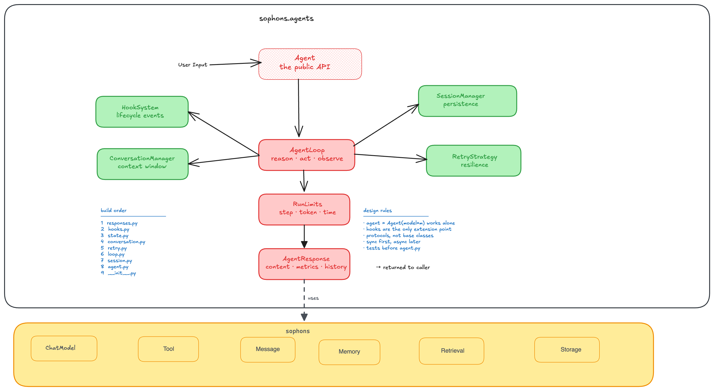

---

## 1. What We Are Building

Sophons already has the low-level building blocks:

- `sophons.models.messages.Message` — the message type
- `sophons.models.chat.ChatModel` — the model interface
- `sophons.tools.base.Tool` — the tool interface
- `sophons.memory` — memory management
- `sophons.retrieval` — retrieval components

What is missing is the **orchestration layer** — the thing that takes all of those
pieces and runs them together in a loop until the agent produces an answer.

That is `sophon-agent`.

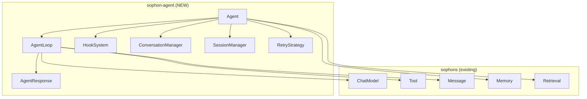

---

## 2. Core Components

Every component has a single clear responsibility.

| Component | Responsibility |
|---|---|
| `HookSystem` | Fire typed events at every lifecycle checkpoint |
| `AgentResponse` | Rich result returned after every run |
| `StopReason` | Why the agent stopped — typed, not a raw string |
| `AgentLoop` | The core reason → act → observe cycle |
| `ConversationManager` | Decide what history the model sees |
| `SessionManager` | Persist and restore agent state across runs |
| `RetryStrategy` | Handle transient failures gracefully |
| `Agent` | Wire everything together behind a simple `.run()` |

---

## 3. The Big Picture — How Everything Connects

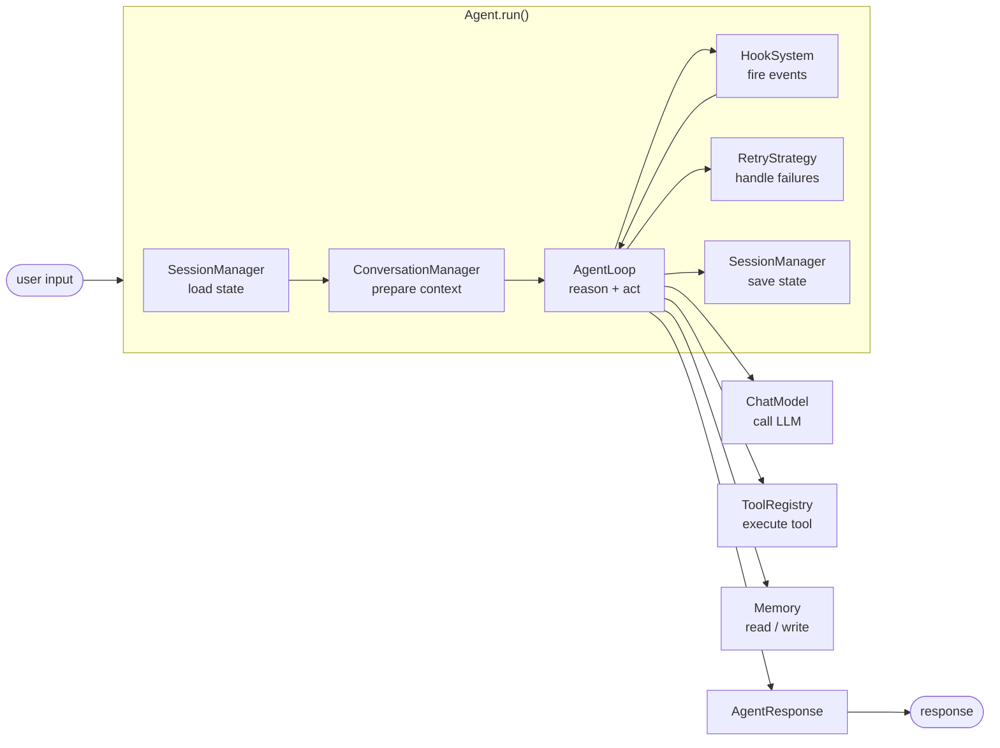

---

## 4. Component by Component

### 4.1 HookSystem — The Heartbeat

**What it does**: Fires typed events at every checkpoint in the agent loop.
Anyone — the developer, an observability tool, a session manager — can listen
to these events without touching the loop.

**Why this matters**: Without hooks, you have to modify the loop to add logging,
tracing, session saving, or any new behavior. With hooks, you just register a listener.
The loop stays clean. Behavior is added from the outside.

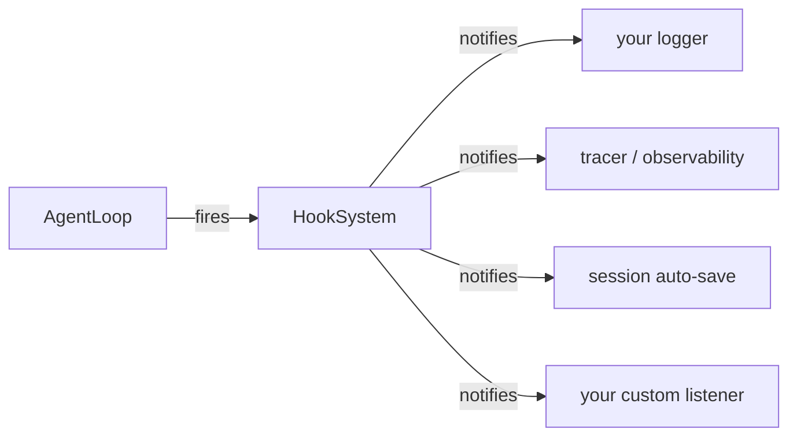

**Events fired at every lifecycle checkpoint**:

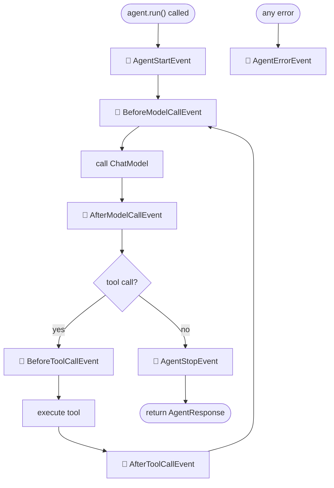

**Interface**:

```python
# Each event is a typed dataclass
@dataclass
class BeforeModelCallEvent:
    messages: list[Message]
    step: int

@dataclass
class AfterModelCallEvent:
    message: Message
    step: int
    duration_ms: float

@dataclass
class BeforeToolCallEvent:
    tool_name: str
    args: dict
    step: int

@dataclass
class AfterToolCallEvent:
    tool_name: str
    result: dict
    step: int
    duration_ms: float

@dataclass
class AgentStartEvent:
    input: str
    session_id: str | None

@dataclass
class AgentStopEvent:
    response: AgentResponse
    stop_reason: StopReason

@dataclass
class AgentErrorEvent:
    error: Exception
    step: int
    recoverable: bool

# The hook system itself
class HookSystem:
    def register(self, event_type: type, handler: Callable) -> None: ...
    def fire(self, event: Any) -> None: ...
```

---

### 4.2 AgentResponse and StopReason

**What it does**: The object returned to the user after every `agent.run()` call.
It contains not just the answer, but everything that happened — steps taken,
tools called, time spent, and why the agent stopped.

**Why this matters**: A plain string answer is useless for debugging, evals,
and observability. A rich response tells you everything that happened in a run.

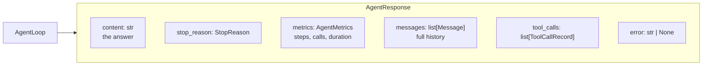

**Stop Reasons — why the agent stopped**:

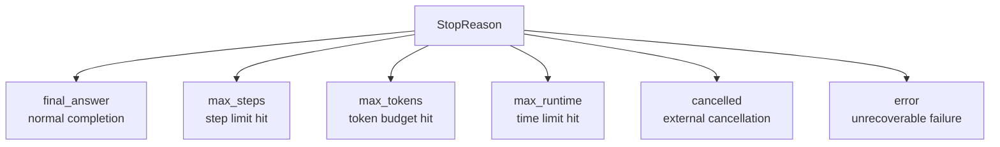

**Interface**:

```python
class StopReason(str, Enum):
    FINAL_ANSWER  = "final_answer"
    MAX_STEPS     = "max_steps"
    MAX_TOKENS    = "max_tokens"
    MAX_RUNTIME   = "max_runtime"
    CANCELLED     = "cancelled"
    ERROR         = "error"

@dataclass
class AgentMetrics:
    steps: int
    model_calls: int
    tool_calls: int
    input_tokens: int
    output_tokens: int
    duration_ms: float

@dataclass
class ToolCallRecord:
    id: str
    name: str
    args: dict
    result: dict
    duration_ms: float

@dataclass
class AgentResponse:
    content: str
    stop_reason: StopReason
    success: bool
    metrics: AgentMetrics
    messages: list[Message]
    tool_calls: list[ToolCallRecord]
    error: str | None = None
```

---

### 4.3 AgentLoop — The Brain

**What it does**: The core loop. Calls the model, reads the response, executes
tools if needed, appends results to the conversation, and repeats until a stop
condition is met.

**Why this matters**: This is the orchestration heart of every agent. Every
other component wraps around this loop or plugs into it via hooks.

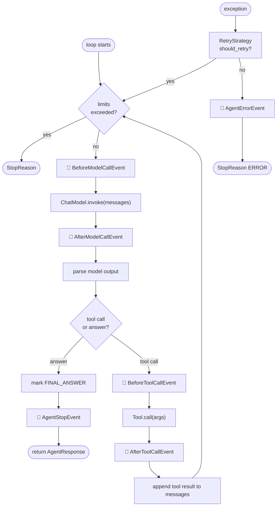

**Run Limits — hard boundaries on every run**:

```python
@dataclass
class RunLimits:
    max_steps: int             = 10
    max_model_calls: int       = 20
    max_tool_calls: int        = 20
    max_tokens: int | None     = None
    max_runtime_seconds: float = 300.0
```

---

### 4.4 ConversationManager

**What it does**: Manages what part of the conversation history the model sees.
As conversations grow, the full history may exceed the model's context window.
The ConversationManager decides what to keep, what to trim, and what to summarize.

**Why this matters**: Without this, long conversations fail with context window
errors. Separating this concern from the loop means the loop never needs to
change when you switch trimming strategies.

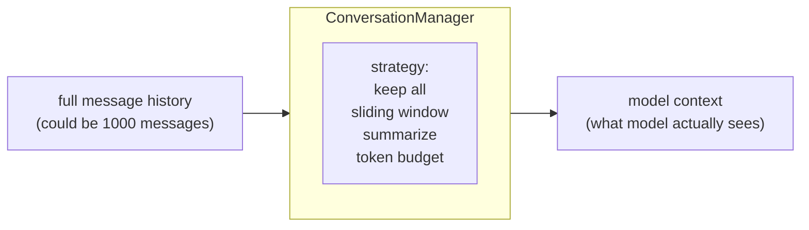

**Three built-in strategies**:

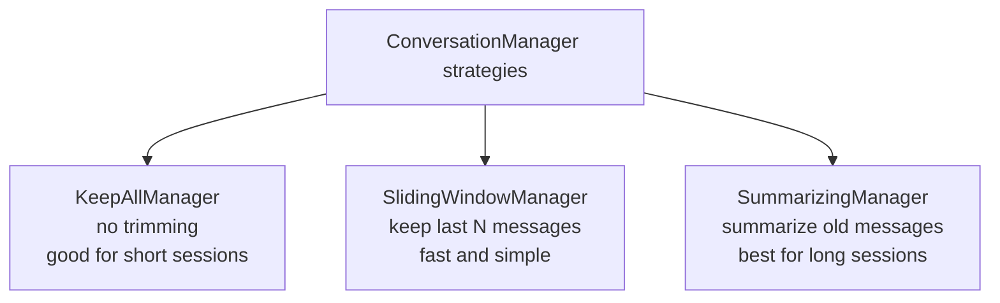

**Interface**:

```python
class ConversationManager(Protocol):
    def prepare(self, messages: list[Message]) -> list[Message]: ...
    # takes full history, returns what the model should see
```

---

### 4.5 SessionManager

**What it does**: Saves and restores agent state across runs. Without it, every
`agent.run()` starts fresh with no memory of previous conversations.

**Why this matters**: Real agents need persistence. A user should be able to
close the app, come back tomorrow, and the agent remembers the conversation.

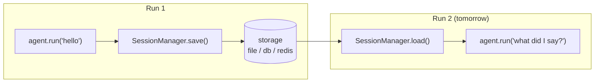

**What gets saved in a session**:

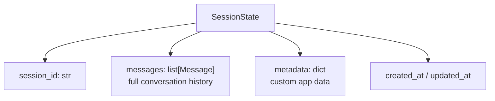

**Interface**:

```python
class SessionManager(Protocol):
    def save(self, session_id: str, state: SessionState) -> None: ...
    def load(self, session_id: str) -> SessionState | None: ...
    def delete(self, session_id: str) -> None: ...
```

**Built-in implementations**:

```python
InMemorySessionManager   # good for testing and single-process apps
FileSessionManager       # saves to JSON files, good for local use
```

---

### 4.6 RetryStrategy

**What it does**: When a model call or tool call fails with a transient error
(network timeout, rate limit), the retry strategy decides whether to try again
and how long to wait before retrying.

**Why this matters**: Production agents fail. Rate limits happen. Networks drop.
A retry strategy makes the agent resilient without cluttering the loop with
error-handling logic.

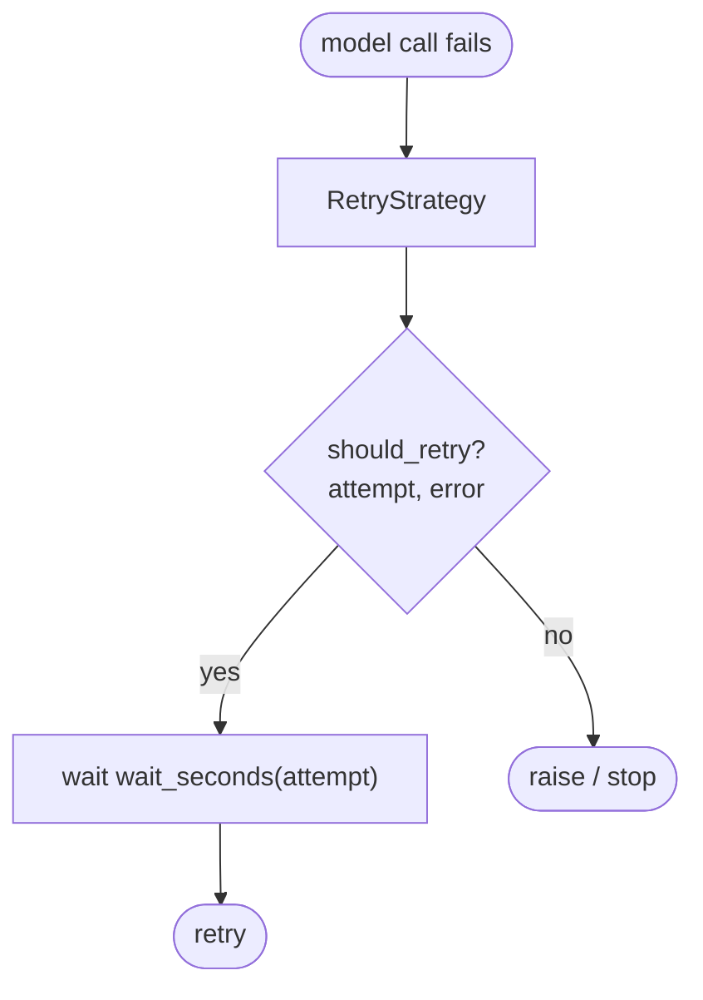

**Interface**:

```python
class RetryStrategy(Protocol):
    def should_retry(self, error: Exception, attempt: int) -> bool: ...
    def wait_seconds(self, attempt: int) -> float: ...
```

**Built-in implementations**:

```python
NoRetry                   # never retries — default, predictable
ExponentialBackoffRetry   # 1s, 2s, 4s, 8s... up to max_attempts
```

---

### 4.7 Agent — The Public Face

**What it does**: The single class developers instantiate. It wires together
all the components above and exposes a simple `.run()` method.

**Why this matters**: Users should not have to know about HookSystem,
ConversationManager, or SessionManager to build an agent. Agent hides the
complexity. One line to create, one line to run.

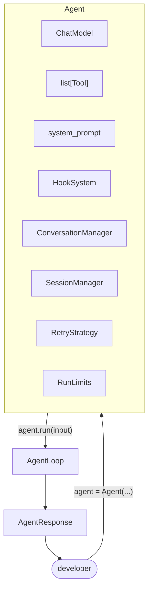

**Interface**:

```python
class Agent:
    def __init__(
        self,
        *,
        model: ChatModel,
        tools: list[Tool] | None = None,
        system_prompt: str | None = None,
        hooks: HookSystem | None = None,
        conversation_manager: ConversationManager | None = None,
        session_manager: SessionManager | None = None,
        retry_strategy: RetryStrategy | None = None,
        limits: RunLimits | None = None,
    ) -> None: ...

    def run(
        self,
        input: str,
        *,
        session_id: str | None = None,
    ) -> AgentResponse: ...

    def add_hook(self, event_type: type, handler: Callable) -> None: ...
```

**Simple usage — what a developer writes**:

```python
from sophon-agent import Agent, RunLimits
from my_models import MyChatModel
from my_tools import web_search

agent = Agent(
    model=MyChatModel(),
    tools=[web_search],
    system_prompt="You are a helpful assistant.",
)

response = agent.run("What is the weather in London?")
print(response.content)
print(response.metrics.steps)
```

---

## 5. File Structure

```
sophons/src/sophon-agent/
│
├── __init__.py            ← public API: Agent, AgentResponse, HookSystem, RunLimits
├── agent.py               ← Agent class
├── loop.py                ← AgentLoop (the core reason + act cycle)
├── hooks.py               ← HookSystem + all event dataclasses
├── responses.py           ← AgentResponse, StopReason, AgentMetrics, ToolCallRecord
├── conversation.py        ← ConversationManager protocol + implementations
├── session.py             ← SessionManager protocol + InMemory + File implementations
├── retry.py               ← RetryStrategy protocol + NoRetry + ExponentialBackoff
└── state.py               ← RunLimits, RunState (tracks steps/calls during a run)
```

---

## 6. Build Order

We build in dependency order — each file only depends on files already built.

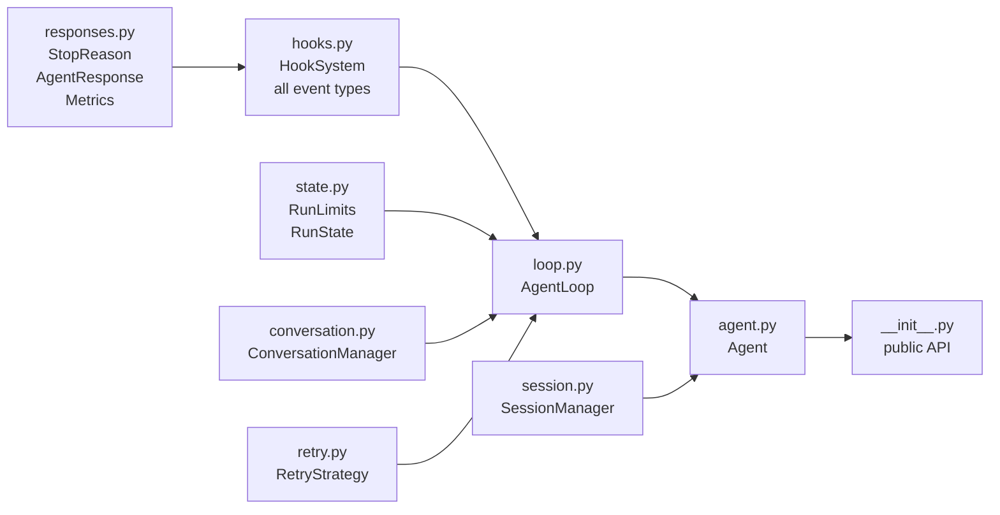

| Step | File | Depends on |
|---|---|---|
| 1 | `responses.py` | nothing |
| 2 | `hooks.py` | `responses.py` |
| 3 | `state.py` | nothing |
| 4 | `conversation.py` | `sophons.models.messages` |
| 5 | `retry.py` | nothing |
| 6 | `loop.py` | `responses.py`, `hooks.py`, `state.py`, `conversation.py`, `retry.py` |
| 7 | `session.py` | `sophons.models.messages` |
| 8 | `agent.py` | everything above |
| 9 | `__init__.py` | `agent.py` |

---

## 7. How ReAct Plugs In

`react-agent-from-scratch` is the first agent built on top of `sophon-agent`.

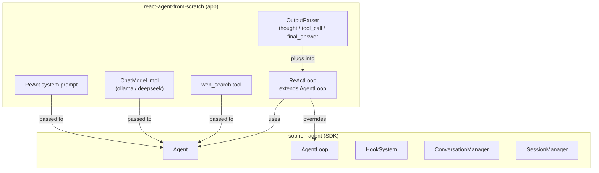

ReAct brings:
- Its own `OutputParser` — JSON thought / action / answer parsing
- Its own system prompt
- Its own model implementations (Ollama, DeepSeek)

Sophons provides:
- The loop infrastructure
- Hooks and observability
- Conversation management
- Session persistence
- Retry handling

---

## 8. Design Rules

These rules keep the SDK clean and maintainable as it grows.

```
1. The Agent knows nothing about model providers.
   It depends on ChatModel, not any specific LLM vendor.

2. The loop knows nothing about storage.
   Session saving happens via hooks, not inside loop.py.

3. Everything is optional except model.
   agent = Agent(model=m) must work with zero other arguments.

4. Hooks are the extension point.
   New behaviors are added by registering hooks, not by modifying loop.py.

5. Protocols over base classes.
   ConversationManager, SessionManager, and RetryStrategy are Protocols.
   Developers can implement their own without inheriting anything from Sophons.

6. Sync first, async later.
   Build sync versions first. Async variants come after the sync API is stable.

7. Tests before the Agent class.
   hooks.py, responses.py, and loop.py all have tests before agent.py is written.
```
